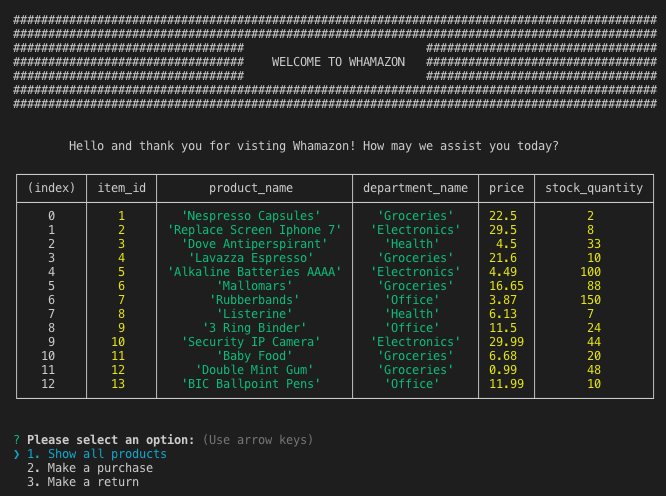
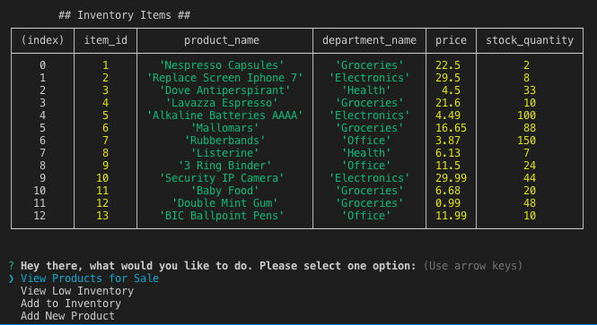
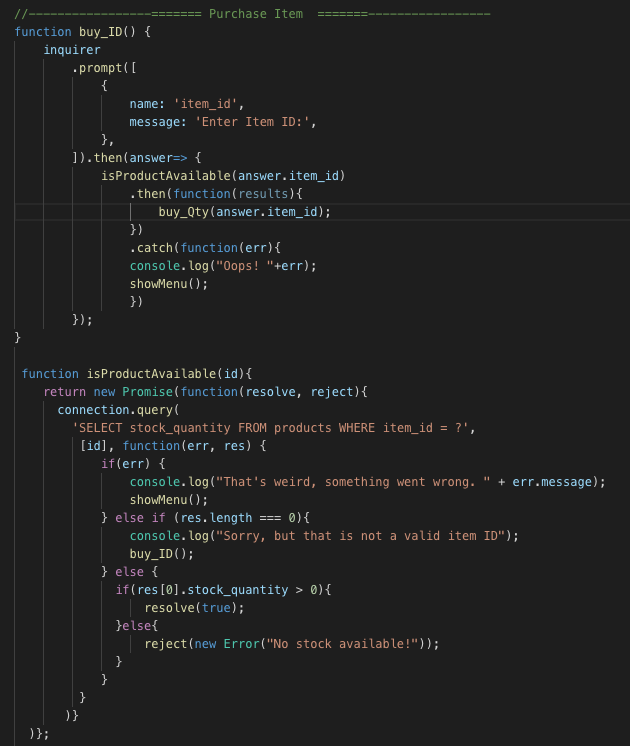

# WHAMAZON

POS and inventory management tool via CLI utilizing Node.js and a MySQL database.

The customer tool gives a customer user 3 options, "View All Inventory", "Make a Purchase", and "Make a Return"

[Please checkout the Customer Tool video Walkthough](https://youtu.be/sYNbFRkSdaE)

The manager tool gives a manager user the ability to "View All Product for Sale", "View Low Inventory", and "Make a Purchase".

Handling asynchronous calls to the database within a Node Inquirer _prompt_ can get a little tricky. Luckily we can use a Promise to evaluate the result of the database call that checks for sufficient stock for the item we selected before the purchase operation can proceed.

In the image below, you can see the code for the purchase product _prompt_. After the user enters an item id the _then()_ method performs a call to database through the isProductAvailable function that returns a Promise that is handled within the original _prompt_ and directs the user to the next appropriate action. 
 

## Resources

[MDN Javascript Promise]
(https://developer.mozilla.org/en-US/docs/Web/JavaScript/Reference/Global_Objects/Promise)

